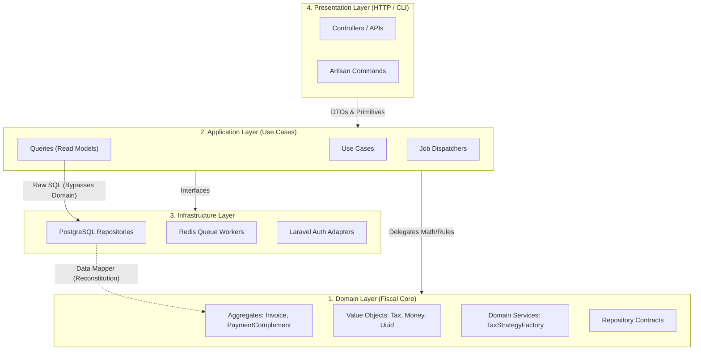

# Architecture & Design Principles

The Fiscal Engine strictly adheres to **Clean Architecture** and **Domain-Driven Design (DDD)**. The central premise is that the framework (Laravel) and the database (PostgreSQL) are mere I/O details. The application's core rules are completely isolated and framework-agnostic.

## Layer Overview

### 1. Domain Layer (The Core)
Contains zero dependencies on external libraries. Everything here is pure PHP.

* **Aggregates:** The transaction boundaries (`Invoice`, `PaymentComplement`). They protect business invariants (e.g., "A cancelled invoice cannot be modified").
* **Value Objects:** Immutable primitives (`Money`, `Tax`, `Uuid`). They encapsulate tiny, strict rules (e.g., "Taxes cannot have negative rates").
* **Domain Events:** Immutable facts (`InvoiceCancelledEvent`) that record what happened for the audit ledger.

### 2. Application Layer (The Orchestrator)
Contains Use Cases (`ImportInvoiceUseCase`, `CancelInvoiceUseCase`).

* **Rule:** Use cases contain no business logic and no math.
* **Responsibility:** They orchestrate flow: fetch from repository -> delegate to domain -> dispatch events -> save via transaction manager.

### 3. Infrastructure Layer (The Details)
Contains the concrete implementations of the contracts defined in the Application and Domain layers.

* **Data Mapper Pattern:** We do not use Eloquent Active Record in the domain. Repositories read Eloquent "Data Bags" and map them into pure Domain Entities.
* **Database Constraints:** Relies heavily on PostgreSQL for idempotency (UUID primary keys) and referential integrity (cascade deletes).
* **Note on Conventions:** To align with upstream legacy systems, all fiscal database tables are explicitly named using `CamelCase` (e.g., `PaymentApplications`, `FiscalAuditLogs`).

### 4. Presentation Layer (The Delivery)
Extremely thin controllers. Their only job is to map HTTP requests to Use Case DTOs and translate Domain Exceptions into HTTP status codes (e.g., `DomainException` -> `422 Unprocessable Entity`).

## Key Architectural Patterns Applied
* **CQRS (Command Query Responsibility Segregation):** Write operations use rich Domain Entities. Read operations bypass the domain entirely, using raw SQL queries.
* **Transactional Outbox / Event-Driven Auditing:** State changes emit events strictly after commit to ensure `FiscalAuditLogs` remain a perfect source of truth.
* **Tolerance Handling:** Absorbs SAT truncation variances (up to 2 cents) at the domain level to prevent blocking valid third-party XMLs.