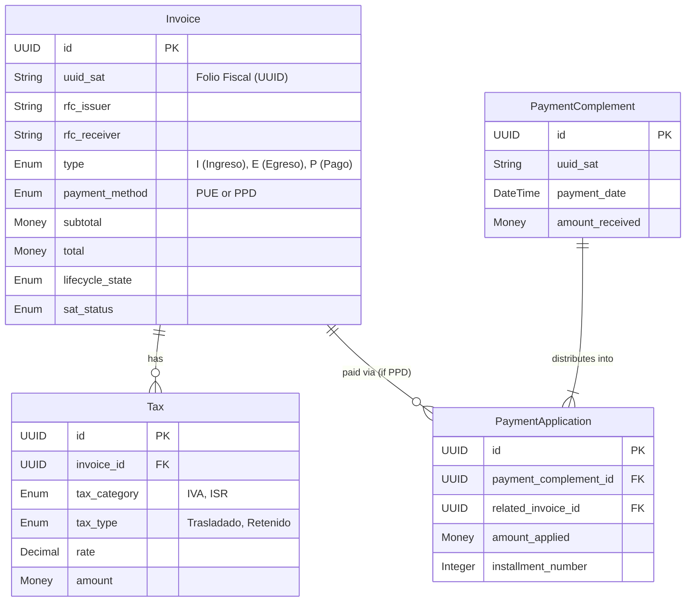

# Domain Entities & Aggregates

The Fiscal Domain is the heart of the engine. It contains the mathematical and structural rules of Mexican fiscal compliance, isolated from the framework and database.

## Entity Relationship Diagram (ERD)

## The Aggregates

### 1. Invoice (Aggregate Root)
The `Invoice` represents a standard CFDI (Ingreso or Egreso). It is the source of truth for debt and taxes.
* **PUE (Pago en una Sola Exhibición):** Assumed paid immediately. No payment complements are expected.
* **PPD (Pago en Parcialidades o Diferido):** Represents a debt. Must be settled over time via one or more `PaymentComplements`.
* **Invariants:**
  * An Invoice cannot be modified once instantiated. Adjustments require a new CFDI (Nota de Crédito) or cancellation.
  * The mathematical sum of its `Tax` value objects must match the difference between `total` and `subtotal` (within SAT rounding tolerances of up to $0.02).

### 2. Payment Complement (Aggregate Root)
The `PaymentComplement` represents a CFDI of type "P" (Pago). It records cash received.
* **Invariant:** A single `PaymentComplement` can satisfy multiple `Invoice` (PPD) debts simultaneously. It cannot apply more money than the `amount_received`.

### 3. Payment Application (Connecting Entity)
Because a single Payment Complement can pay multiple Invoices, and a single Invoice can be paid by multiple Payment Complements over time, `PaymentApplication` resolves this M:N relationship.
* It explicitly ties exactly how much cash from a specific `PaymentComplement` was applied to a specific `Invoice`.

## Value Objects & Enums

* **Tax (Value Object):** Encapsulates the calculation of taxes. Contains rules preventing negative rates and strictly defining rounding to 2 or 6 decimal places as dictated by the SAT.
* **LifecycleState (Enum):** Internal states (`DRAFT`, `ACTIVE`, `CANCELLED`, `PENDING_CANCELLATION`). Used for business rule guarding.
* **SatStatus (Enum):** External SAT verification states (`VALID`, `CANCELLED`, `NOT_FOUND`).