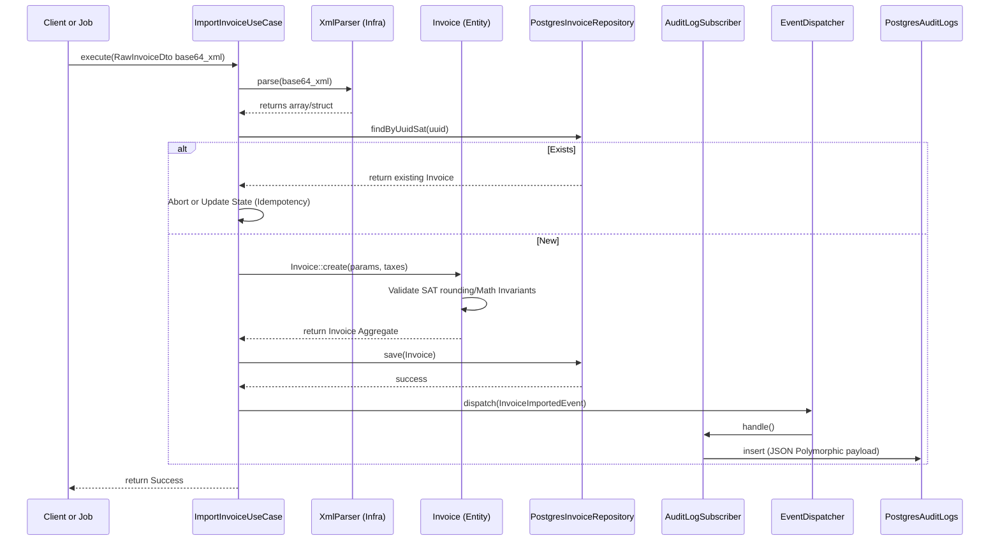

# Data Flow & Lifecycle

The ingestion and processing of a CFDI is highly structured to guarantee idempotency and mathematical correctness. The system operates on a "Wipe and Replace" or "Upsert" philosophy for stateless idempotency.

## Ingestion Pipeline Sequence

## Lifecycle States

The data flows through strict state changes bound by CQRS and Event rules:

1. **Ingestion (Write)**
   * XML is uploaded, decoded, and parsed.
   * Extracted into primitives, which are fed into the `Invoice` Aggregate constructor.
   * Domain rules fire (validating RFC formats, summing totals, checking limits).
   * Successful instantiation means the data is legally valid according to system bounds.

2. **Persistence (Write)**
   * The `PostgresInvoiceRepository` disassembles the `Invoice` Aggregate.
   * Extracted values are inserted into `Invoices` and `Taxes` tables.
   * All inserts share a Database Transaction. An error mapping the `Tax` value object will rollback the entire `Invoice`.

3. **Reconciliation (Async)**
   * If an `Invoice` is PPD, background jobs listen to its creation.
   * They scan for orphan `PaymentComplements` that might belong to the same RFC.
   * Conversely, if a `PaymentComplement` is ingested, the system resolves its `PaymentApplication` nodes against existing `Invoice` aggregates.

4. **Reporting (Read)**
   * A controller requests a Monthly Summary.
   * **Bypasses Domain:** The system does NOT load thousands of `Invoice` objects into RAM.
   * `PostgresMonthlyTaxesQuery` executes a raw, highly optimized PostgreSQL query and returns a simple read-model DTO (`MonthlyFiscalSummary`).