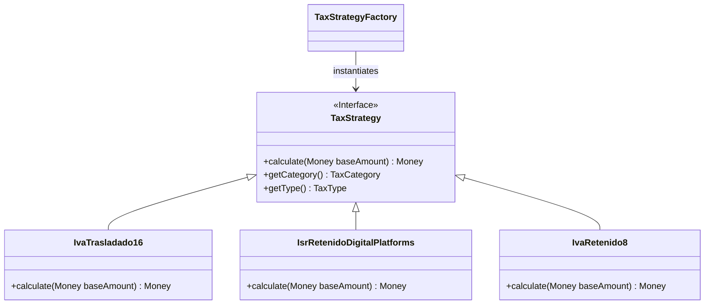

# Tax Engine & Calculations

The Tax Engine is responsible for deriving, validating, and calculating all fiscal retentions and transfers (Traslados y Retenciones) associated with operations. Since different regimes and concepts demand different calculations, we utilize the **Strategy Pattern**.

## Tax Strategy Design

## Core Principles

### 1. Separation of Retentions and Transfers
The engine calculates both:
* **Traslados (Transfers):** Taxes added to the subtotal (e.g., IVA 16%, IEPS).
* **Retenciones (Retentions):** Taxes deducted from the subtotal before payment (e.g., ISR Retenido 2.1%, IVA Retenido 8%).

### 2. Tolerance & Rounding
Mexican CFDI logic is notoriously prone to 1-to-2 cent discrepancies due to precision rounding from 6 decimals down to 2 across multiple line items. 

The domain allows a **Tolerance Boundary**. If the SAT XML provides a total of `116.01` but strict math yields `116.00`, the domain accepts it **if and only if** the delta is `<= $0.02`.
* *See ADR:* `docs/architecture/decisions/0001-sat-rounding-tolerance-in-fiscal-core.md`

### 3. PPD and Proportional Taxation
When an Invoice is strictly **PUE**, taxes are applied fully to the month it was issued.
When an Invoice is **PPD**, the taxes are not fully realized until the `PaymentComplement` dictates cash has changed hands. 

The tax engine calculates the **Proportion Factor** (`Amount Paid / Original Total`) and applies this exact factor to all individual `Tax` nodes to determine how much of each tax was "realized" during this payment application.