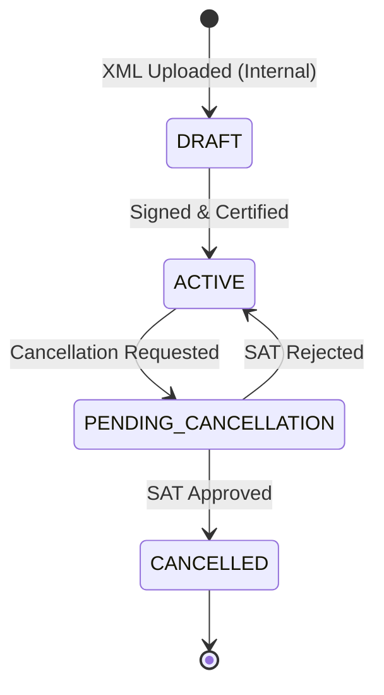

# Cancellations & Consistency

Unlike a simple `DELETE` command in a standard CRUD application, fiscal documentation requires perfect chronological auditing. Standard CFDIs can be cancelled, but the system must handle state transitions immutably.

## Cancellation State Machine

## Rules of Cancellation

### 1. No Soft or Hard Deletions
We do not use Eloquent's `SoftDeletes` trace, nor do we `DELETE FROM Invoices`. Invoices transition their `LifecycleState` enum to `CANCELLED`. 

### 2. Cascading Side Effects
When an `Invoice` is marked as cancelled, an `InvoiceCancelledEvent` is dispatched. 
* Any `PaymentApplication` nodes connecting a `PaymentComplement` to this `Invoice` are dynamically evaluated.
* If a `PaymentComplement` has no valid `PaymentApplications` remaining, it becomes an orphaned payment that requires manual reconciliation or a subsequent cancellation from the issuer.
* *Reference ADR:* `docs/architecture/decisions/0002-wipe-and-replace-strategy-for-payment-applications.md`

### 3. SAT Synchronization
The SAT operates asynchronously. An `Invoice` that we requested to cancel is placed in `PENDING_CANCELLATION`.
Scheduled jobs systematically poll the SAT webservices to verify if the Status changed to `Cancelado`. Once confirmed, the final transition to `CANCELLED` takes place, triggering the respective Domain Event into the `FiscalAuditLogs`.