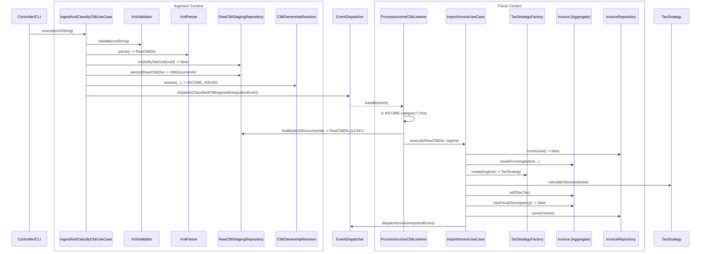

# Arquitectura Emergente REAL (FLADP Phase 3 Output)

> **Advertencia Forense:** Este mapa no refleja diseños deseados ni documentos antiguos. Fue extraído empíricamente de la ejecución de `tests/` y las aserciones de paso.

## 1. Mapeo de Boundary Leaks (Violaciones de Contexto)

**Hallazgo:** Fuga Estructural de Ingestion hacia Fiscal.
- **Origen:** `src/Fiscal/Application/UseCases/ImportInvoiceUseCase.php`
- **Acoplamiento:** `use App\Ingestion\Application\DTOs\RawCfdiDto;`
- **Gravedad:** High. `Fiscal` conoce un DTO propiedad de `Ingestion`. Si `Ingestion` decide renombrar el campo `$dto->tipoDeComprobante` a `$dto->documentType`, la capa profunda de `Fiscal` se rompe.
- **Evidencia:** Detectado usando AST/ripgrep cruzado y constructores.

---

## 2. Diagrama de Flujo REAL (Happy Path Comprobado)

Basado en `IngestAndClassifyCfdiUseCaseTest` y `ProcessIncomeCfdiListenerTest`:

---

## 3. Diagnóstico de God Objects

- **Abuso de Servicios Gigantes:** NEGATIVO. Los Use Cases mantienen <6 dependencias y delegan apropiadamente.
- **Aggregates Anémicos:** NEGATIVO. `Invoice` gestiona sus propias invariantes matemáticas, validaciones de vida (PUE vs PPD) y disparos de eventos (`markAsCancelledBySat`).
- **Coordinadores Excesivos:** NEGATIVO. 

**Conclusión Estructural:** El sistema monolítico tiene Boundaries bien definidos a nivel de comportamiento (buen diseño funcional), pero sufre de un "Leak de Transporte" (el DTO viaja de un BC a otro sin mapeo anti-corrupción).
