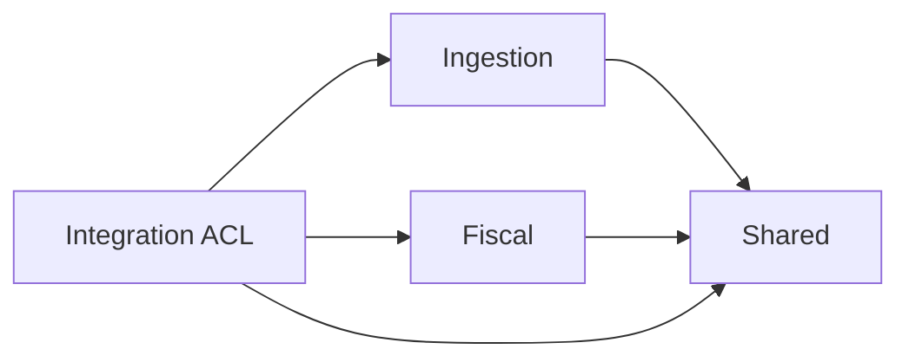

# Phase 1A — Architecture Stabilization

Status: implemented on `codex/phase-1a-architecture-stabilization` (2026-07-11).

## Runtime boundary

`JobDispatcherInterface` and `LaravelJobDispatcher` now expose the same method:
`dispatchIngestCfdi(string $xmlContent): void`. The adapter receives the concrete
queue callback at composition time, so Shared no longer imports or statically
dispatches a Fiscal job. The obsolete `ProcessInvoiceJob` was removed because its
payload could not satisfy `ImportInvoiceUseCase` and it had no remaining caller.

## Anti-corruption boundary

`ProcessIncomeCfdiListener` lives in the top-level Integration layer. It hydrates
through `Ingestion\Application\Contracts\RawCfdiStagingRepositoryInterface`, maps
the ingestion snapshot into Fiscal's `InvoiceImportData`, and then invokes
`ImportInvoiceUseCase`. Fiscal therefore has no dependency on `RawCfdiDto` or on
Ingestion infrastructure.

## Invariants preserved

Phase 1A changes orchestration and dependency direction only. It does not alter
the Invoice aggregate, discrepancy tolerance, tax percentages, rounding rules,
or the behavior of `Regime625TaxStrategy`.

## Composition requirement

The application bootstrap must construct `LaravelJobDispatcher` with a callable
that queues the ingestion pipeline for the provided XML. This repository does not
contain a Laravel service-provider/bootstrap composition root, so that binding
remains an integration responsibility of the host application.
