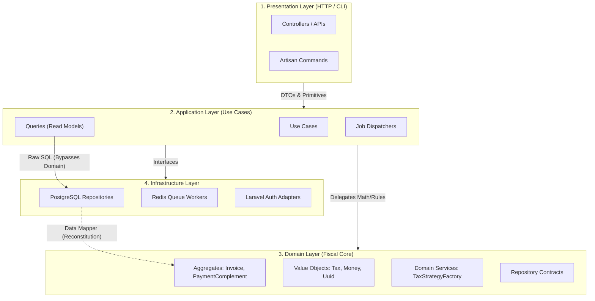

```mermaid
flowchart TD
    subgraph Presentation["1. Presentation Layer (HTTP / CLI)"]
        Controllers["Controllers / APIs"]
        Console["Artisan Commands"]
    end

    subgraph Application["2. Application Layer (Use Cases)"]
        UC["Use Cases"]
        CQRS["Queries (Read Models)"]
        Jobs["Job Dispatchers"]
    end

    subgraph Domain["3. Domain Layer (Fiscal Core)"]
        Aggregates["Aggregates: Invoice, PaymentComplement"]
        VO["Value Objects: Tax, Money, Uuid"]
        Services["Domain Services: TaxStrategyFactory"]
        Interfaces["Repository Contracts"]
    end

    subgraph Infrastructure["4. Infrastructure Layer"]
        Postgres["PostgreSQL Repositories"]
        Queue["Redis Queue Workers"]
        Auth["Laravel Auth Adapters"]
    end

    Presentation -->|"DTOs & Primitives"| Application
    Application -->|"Delegates Math/Rules"| Domain
    Application -->|"Interfaces"| Infrastructure
    CQRS -->|"Raw SQL (Bypasses Domain)"| Postgres
    Postgres -.->|"Data Mapper (Reconstitution)"| Aggregates
```
