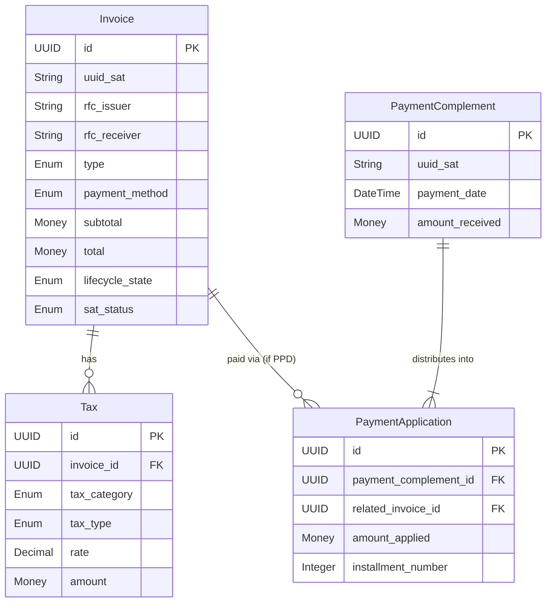

```mermaid
erDiagram
    Invoice {
        UUID id PK
        String uuid_sat
        String rfc_issuer
        String rfc_receiver
        Enum type
        Enum payment_method
        Money subtotal
        Money total
        Enum lifecycle_state
        Enum sat_status
    }

    PaymentComplement {
        UUID id PK
        String uuid_sat
        DateTime payment_date
        Money amount_received
    }

    PaymentApplication {
        UUID id PK
        UUID payment_complement_id FK
        UUID related_invoice_id FK
        Money amount_applied
        Integer installment_number
    }

    Tax {
        UUID id PK
        UUID invoice_id FK
        Enum tax_category
        Enum tax_type
        Decimal rate
        Money amount
    }

    Invoice ||--o{ Tax : "has"
    Invoice ||--o{ PaymentApplication : "paid via (if PPD)"
    PaymentComplement ||--|{ PaymentApplication : "distributes into"
```