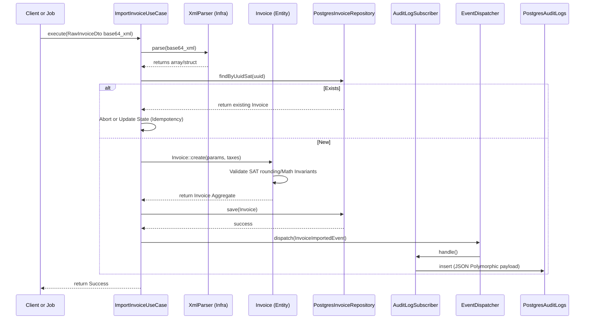

```mermaid
sequenceDiagram
    participant Client or Job
    participant UseCase as ImportInvoiceUseCase
    participant Parser as XmlParser (Infra)
    participant Domain as Invoice (Entity)
    participant Repo as PostgresInvoiceRepository
    participant Event as AuditLogSubscriber

    Client or Job->>UseCase: execute(RawInvoiceDto base64_xml)
    UseCase->>Parser: parse(base64_xml)
    Parser-->>UseCase: returns array/struct
    
    UseCase->>Repo: findByUuidSat(uuid)
    alt Exists
        Repo-->>UseCase: return existing Invoice
        UseCase->>UseCase: Abort or Update State (Idempotency)
    else New
        UseCase->>Domain: Invoice::create(params, taxes)
        Domain->>Domain: Validate SAT rounding/Math Invariants
        Domain-->>UseCase: return Invoice Aggregate
        
        UseCase->>Repo: save(Invoice)
        Repo-->>UseCase: success
        
        UseCase->>EventDispatcher: dispatch(InvoiceImportedEvent)
        EventDispatcher->>Event: handle()
        Event->>PostgresAuditLogs: insert (JSON Polymorphic payload)
    end
    
    UseCase-->>Client or Job: return Success
```