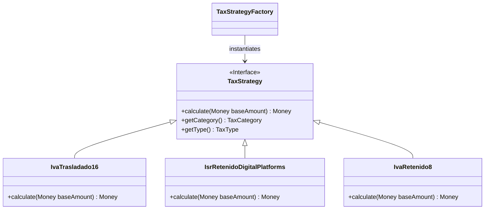

```mermaid
classDiagram
    class TaxStrategy {
        <<Interface>>
        +calculate(Money baseAmount) Money
        +getCategory() TaxCategory
        +getType() TaxType
    }
    
    class IvaTrasladado16 {
        +calculate(Money baseAmount) Money
    }
    
    class IsrRetenidoDigitalPlatforms {
        +calculate(Money baseAmount) Money
    }
    
    class IvaRetenido8 {
        +calculate(Money baseAmount) Money
    }
    
    TaxStrategy <|-- IvaTrasladado16
    TaxStrategy <|-- IsrRetenidoDigitalPlatforms
    TaxStrategy <|-- IvaRetenido8
    
    TaxStrategyFactory --> TaxStrategy : instantiates
```